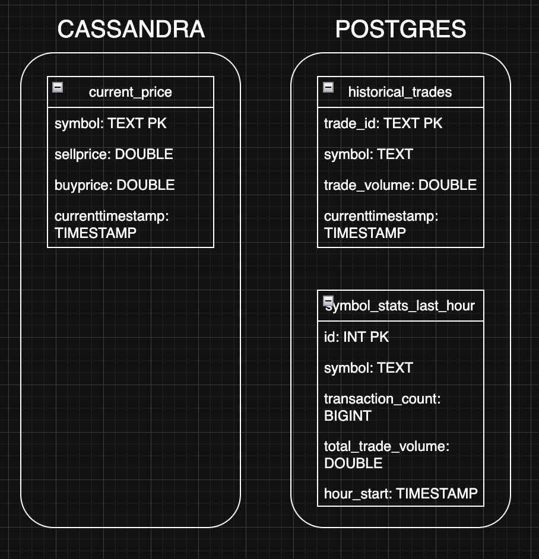

# CRYPTOCURRENCY BATCHING AND STREAMING

## ARCHITECTURE DESIGN

### Overview:

Chosen cryptocurrencies pairs: XBTUSDT, ETHUSDT, SOLUSDT, XRPUSDT, LINKUSDT.

To meet the specified requirements for the REST API, we decided to build a system that will use two websocker threads from the BitMex marketplace. The first stream *trades* gives us data about completed transactions in real time. The second stream *quote* gives us the best buy and sell price in real time (the best order at each moment of time). To process this data, we use the following tools: python - for the initial reading from the web socket, sorting the relevant information, and sending the data to Kafka topics; Kafka - for storing and collecting the processed data; Spark Streaming API - for processing the data from Kafka and storing it in Cassandra and Postgres (in the next section, we will tell you why we decided to use these databases). We also have an additional Spark task that runs every hour and calculates aggregate statistics of the processed (already in the database) *trade* data and writes the results to a new table in Postgres. Finally, we have an API service that gives the user the ability to receive the processed data and its statistics.

### Services:
- **PRODUCERS**: services which process data from websockets and send it to kafka. They are two python scripts (one for *trades* subscription and another for *quote* subscription) which are in seperate docker containers;
- **KAFKA**: service which is used to store and collect real-world data. It has two topics: *order* (for *quote*) and *trades* (for *trades*);
- **ZOOKEEPEr**: coordination service used by Kafka to manage its broker;
- **SPARK MASTER**: coordiantion service for Spark cluster, in our case for one worker
- **SPARK WORKER**: service which executes Spark tasks. In our case: process two streaming (read from Kafka and write one stream to Postgres and one to Cassandra) and calculate aggregated statistics every hour (using cron cli);
- **CASSANDRA**: database for storing frequently updated data from websocker with orders;
- **POSTGRES**: database for storing raw data from trades and aggregated data from trades;
- **API**: service to interace with orders data and trades data;

## DATA MODEL

### Why Cassandra?
We decided to use Cassandra for storing *orders* data, because it is good at handling frequently update data, and it updates old data entries if new input data have the same primary key (it is used to answer question 3 from Category B: we only need to store current price of currencies, not historical).

### Why Postgres?
We chose to use Postgres to store the *trades* data because we needed to use **GROUP BY**'s to calculate aggregate statistics, and we needed to have flexible filtering to answer the questions from categories A and B (both of which are not supported in Cassandra). In addition, the *trades* stream is not very fast, so we don't need to write data very often, as in the case of order data.

### Data model
Data model is very simple. We store only data which will be used in aggregation or asnwering questions. Also, these tables are designed to minimize data repetition.
#### Tables
- current_price:
    - symbol: symbol of cryptocurrency;
    - sellprice: current best sell price;
    - buyprice: current best but price;
    - currenttimestamp: time when the data was inserted;
- historical_trades:
    - trade_id: unique trade identifier;
    - symbol: symbol of cryptocurrency;
    - trade_volume: volume of transaction (in USDT);
    - currenttimestamp: time when the data was inserted;
- symbol_stats_last_hour:
    - id: identifier;
    - symbol: symbol of cryptocurrency;
    - transaction_count: amount of transactions for specific symbol in hour;
    - total_volume_trade: sum of all transactions volumes for specific symbol in hour
    - hour_start: represent timestamp for which statistics was calculated;

## RESULTS
1. `http://127.0.0.1:8000/transactions_count_last_6_hours`

2. `http://127.0.0.1:8000/trade_volume_last_6_hours`

3. `http://127.0.0.1:8000/hourly_stats_last_12_hours`

4. `http://127.0.0.1:8000/transactions_in_last_n_min?symbol=SOLUSDT&n_minutes=20`

5. `http://127.0.0.1:8000/top_n_highest_volumes?top_n=3`

6. `http://127.0.0.1:8000/current_price?symbol=ETHUSDT`


## DASHBOARD

A Streamlit Dashboard is available for convenient visualization of all data.

### Running the Dashboard

1. Install dependencies:
```bash
pip install -r dashboard_requirements.txt
```

2. Run the dashboard:
```bash
streamlit run dashboard.py
```

Or use the script:
```bash
chmod +x run_dashboard.sh
./run_dashboard.sh
```

3. Open your browser at: `http://localhost:8501`

### Dashboard Features

The dashboard contains 5 main tabs:

- **📈 6-Hour Statistics**: Charts showing transaction count and trade volume for the last 6 hours
- **📊 12-Hour Statistics**: Comprehensive statistics with detailed table
- **🔍 Detailed Analysis**: Analysis of transactions for the last N minutes for a selected symbol
- **🏆 Top Volumes**: Top N symbols by trade volume with interactive chart
- **💵 Current Prices**: Current buy/sell prices with spread calculation

### Settings

In the sidebar you can:
- Change API URL (default: `http://localhost:8000`)
- Enable logarithmic scale
